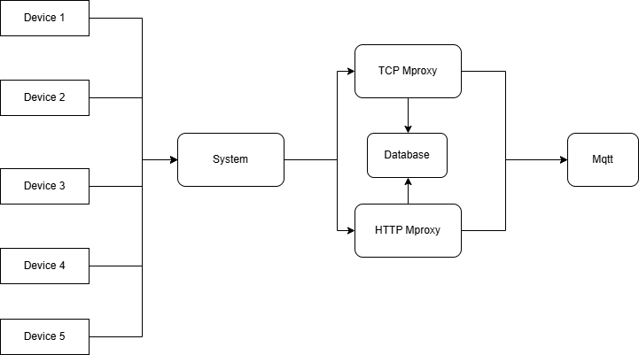

# MProxy Server with MQTT

This project implements two mproxy servers which are **TCP Proxy Server** and **HTTP Server**. These process incoming messages, check for spamming based on device IDs, store messages in a MySQL database, and forward valid messages to the MQTT broker.

## Requirement
- **Go Programming Language** (1.23.4)
- **MySQL Database**
- **MQTT Broker** (Mqtt Explorer)
- **Image Vernemq** (Run on Docker)
- Required Go modules:
  - `github.com/go-sql-driver/mysql`
  - `github.com/eclipse/paho.mqtt.golang`

## Features
- **TCP MProxy Server:** Listens for incoming client connections on port 1884.
- **HTTP Server:** Listens and accepts HTTP POST requests on `localhost:1885/message`.
- **Authorization:** Devices are recognized by Id via token
- **Spam Checking:** Blocks a device ID in case of sending messages too frequently.
- **Database Storage:** Stores incoming messages in a MySQL database.
- **MQTT Forwarding:** Forwards valid messages to the MQTT broker.

## Installation
1. Clone the repository:
   ```bash
   git clone <repository-url>
   cd <repository-folder>
   ```

2. Install the required Go modules:
   ```bash
   go get github.com/go-sql-driver/mysql
   go get github.com/eclipse/paho.mqtt.golang
   go mod tidy
   ```

3. Set up a MySQL database and create a table for storing messages:
   ```sql
   CREATE DATABASE proxy;
   USE proxy;
   CREATE TABLE messages (
       id INT AUTO_INCREMENT PRIMARY KEY,
       message TEXT NOT NULL,
       device_id VARCHAR(255) NOT NULL,
       timestamp DATETIME NOT NULL
   );
   ```

4. Install Image Vernemq on Docker:
    ```bash
    docker pull vernemq/vernemq
    docker run -d --name vernemq-broker -p 1883:1883 -p 8080:8080 -e "DOCKER_VERNEMQ_ACCEPT_EULA=yes" -e "DOCKER_VERNEMQ_ALLOW_ANONYMOUS=on" vernemq/vernemq
    docker start vernemq-broker
    ```

## Configuration
- The database connection string is hardcoded in the `handleClientMessages` function:
  ```go
  "root:<your_mysql_password>@tcp(127.0.0.1:3306)/proxy?parseTime=true&loc=Local"
  ```
- The MQTT broker address is configured in the `getBrokerClient` function:
  ```go
  opts.AddBroker("mqtt://localhost:1883")
  ```

## Running the Project
1. Start the proxy server:
   ```bash
   docker start vernemq-broker
   go run main.go
   ```

2. The server listens on `localhost:1884` for incoming TCP connections.
3. The HTTP server listens on `localhost:1885/message` for POST requests.
4. The broker listens on `localhost:1883` for receiving messages.

## Architecture
   - When the program starts, 2 mproxy servers are listening on 2 different ports for message incoming.  
   - The messages sent by devices are assigned to the appropriate mproxy server for being processed.
   - The valid messages are finally published to mqtt broker.
<p align="center">
  
</p>

## How It Works
1. **Client Connection:**
   - Clients connect to the proxy server via TCP on `localhost:1884` or through `POST/localhost:1885`.

2. **Message Handling:**
   - The server receives messages in JSON format containing a `device_id` and `message`.

3. **Spam Check:**
   - Checks the database for the last 5 message timestamp for the given `device_id`.
   - In case the average gap time of the 5 latest message is 

4. **Database Storage:**
   - Stores the message in the MySQL database.

5. **MQTT Forwarding:**
   - Forwards the valid message to the MQTT broker on the topic `test/message`.

## Example Message Format
```json
{
  "device_id": "device1",
  "message": "Hello, World!"
}
```

## Testing

### 1. For TCP:
#### Simple Go Code for Testing
```go
package main

import (
	"encoding/json"
	"fmt"
	"net"
)

func main() {
	host := "127.0.0.1"
	port := 1884
	addr := fmt.Sprintf("%s:%d", host, port)

	conn, err := net.Dial("tcp", addr)
	if err != nil {
		fmt.Println("Error connecting to server:", err)
		return
	}
	defer conn.Close()

	message := map[string]string{
		"token": "",
		"message":   "Hello",
	}
   // In case not signed in
   // message := map[string]string{
	// 	"device_id": "",
	// 	"password":   "",
	// }

	jsonMessage, err := json.Marshal(message)
	if err != nil {
		fmt.Println("Error encoding JSON:", err)
		return
	}

	_, err = conn.Write(jsonMessage)
	if err != nil {
		fmt.Println("Error sending message:", err)
		return
	}

	fmt.Println("Message sent successfully")
}

```

### 2. For HTTP: Using Postman
- **Method:** POST
- **URL:** `http://localhost:1885/message`
- **Header:**
  - Key: `Content-Type`
  - Value: `application/json`
- **Body:**
    ```json
    {
      "token": "",
      "message": "Hello!"
    }
    ```
- In case not signed in
   ```json
   {
      "device_id": "",
      "password": ""
   }
   ```
- **Response:**
  - `200 OK`: Message processed successfully.
  - `401 Unauthorized`: Unauthorized
  - `400 Bad Request`: Invalid JSON format.
  - `404 Not Found`: The server might not have run properly.
  - `405 Method Not Allowed`: Request method other than POST.

